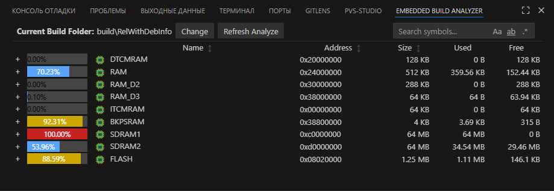

# Embedded Build Analyzer 🚀  
[](LICENSE)
[](#)

> Visual memory analyzer for embedded projects – works with `.map` and `.elf` files, no matter what toolchain or build system you use.



---

## ❓ About This Extension

This extension is part of the **[Embedded Project Manager](https://github.com/embeddteam/EmbeddedProjectManager.git)** – a comprehensive toolkit for embedded systems development in VS Code.

---

## 🚀 Key Improvements in This Fork

✅ **Removed CMake dependency** – Works with any build system (Makefile, CubeIDE, etc.)  
✅ **Custom build folder support** – Easily set via UI button or command  
✅ **Improved file discovery** – More robust handling of `.map` and `.elf` files  
✅ **Optimized UI** – Visual memory usage indicators and new interactive controls  

---

## 🔍 Features

- Memory region analysis using `.map` and `.elf` files
- Detailed breakdown of memory sections and symbols
- Clickable links from symbols to source files
- Visual panel with color-coded usage (RAM, Flash)
- ARM toolchain integration (`arm-none-eabi-objdump`, `nm`)
- Compatible with any toolchain producing `.elf` files (ARM GCC, Keil, IAR, etc.)
- Search functionality for symbols (case-sensitive, whole word, regex options)
- Sorting by name, address, and size (ascending/descending)

---

## 📦 Installation

### From VS Code Marketplace (Coming soon)

📥 [Marketplace link placeholder](https://marketplace.visualstudio.com/items?itemName=embeddteam.embedded-build-analyzer#)

### Manual Installation

#### Requirements

1. Node.js installed  
2. npm installed  
3. `vsce` installed:

   ```bash
   npm install -g @vscode/vsce
   ```

#### Build and Install manual

1. Clone the repository:

   ```bash
   git clone https://github.com/avlaak/embedded-build-analyzer.git
   cd embedded-build-analyzer
   ```

2. Install dependencies:

   ```bash
   npm install
   ```

3. Build the .vsix package using vsce:

   ```bash
   vsce package
   ```

4. This will generate a file like: `embedded-build-analyzer-1.1.3.vsix`

5. Install the extension in VS Code:

   ```bash
   code --install-extension embedded-build-analyzer-1.1.3.vsix
   ```


---

## 🛠 Usage

- Open the Command Palette (`Ctrl+Shift+P`) and run:
  - `Embedded Build Analyzer` – opens the main view
  - `Embedded Build Analyzer Refresh Paths` – re-detects build output folder
- Analyzer view updates automatically when build output files change.

---

## 📜 Changelog

See [CHANGELOG.md](CHANGELOG.md) for full version history.

---

## 🤝 Contributing
 
Contributions are welcome! Please fork the repo and submit a pull request:

1. Fork the repository
2. Create your feature branch (`git checkout -b feature-name`)
3. Commit your changes (`git commit -m "Add feature"`)
4. Push to branch (`git push origin feature-name`)
5. Open a Pull Request

If you find bugs or want to request features, feel free to [open an issue](https://github.com/avlaak/embedded-build-analyzer/issues).


---

## ⚖️ License & Attribution

This extension is licensed under the [MIT License](LICENSE).  
Originally created by Aleksei Perevozchikov ([ATwice291](https://github.com/ATwice291))  
Fork maintained by [avlaak](https://github.com/avlaak) with enhancements described above.

---

<!-- SEO note -->
Embedded Build Analyzer for memory usage, symbol tracking, and map/elf inspection – compatible with Makefiles, CubeIDE, and other toolchains.

## ❤️ Thank you for using this version of Embedded Build Analyzer!

</br></br>
<div align="center">

***


***
</div>